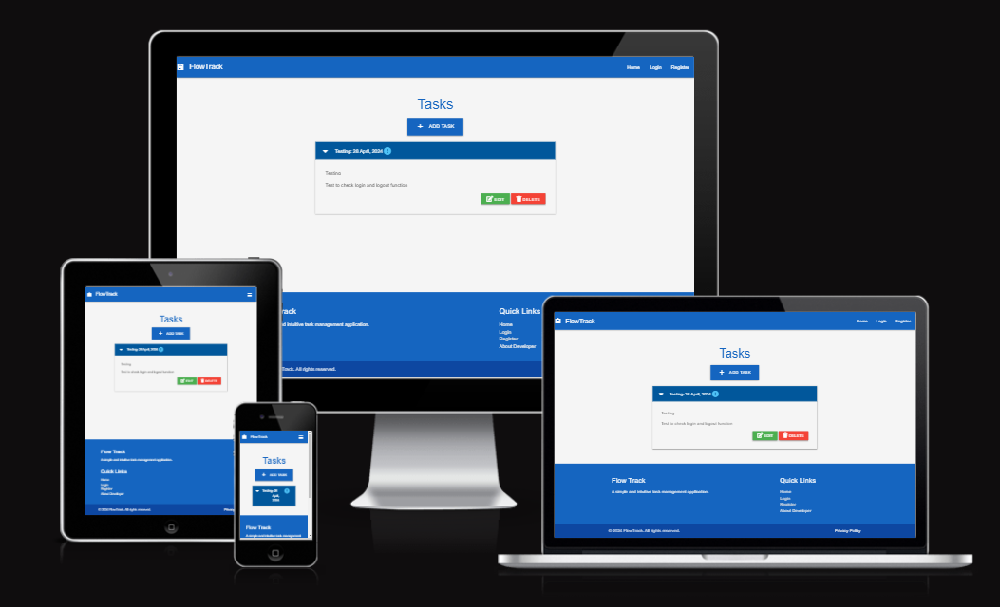

# Flow Track Task Manager

## Overview

The Flow Track task manager application is a Flask-based task management system with CRUD operations for tasks and categories. It allows users to create, view, edit, and delete tasks, as well as manage task categories. The application utilizes Materialize CSS for styling and responsiveness.

## Project Structure

- **run.py**: Main Flask application file containing route definitions and CRUD operations.
- **templates/**: HTML templates for rendering user interfaces.
- **static/**: Static assets such as CSS, JavaScript, and images.
- **taskmanager/**: Python package containing models, routes, and tests.

## Features

- Display summary of tasks on home page with name, due date, urgency, category, and description.
- Users can create, view, edit, and delete tasks.
- Users can perform CRUD operations for task categories.

## Getting Started

To run the project locally:

1. Clone this repository.
2. Install dependencies with `pip install -r requirements.txt`.
3. Run the Flask application with `python run.py`.
4. Access the application at `http://localhost:5000`.

## Project Demo

[Link to project demo](https://flow-track-280cd8f8f022.herokuapp.com/) 

## Additional Features

- User authentication with login, logout, and registration.
- Improved security with password hashing.
- Dynamic task editing and deletion.
- Enhanced UI with Materialize CSS.
- Responsive design for mobile and desktop.

## Credits

This project was created by Yoseph as a mini-project for learning Flask web development and SQLAlchemy ORM.